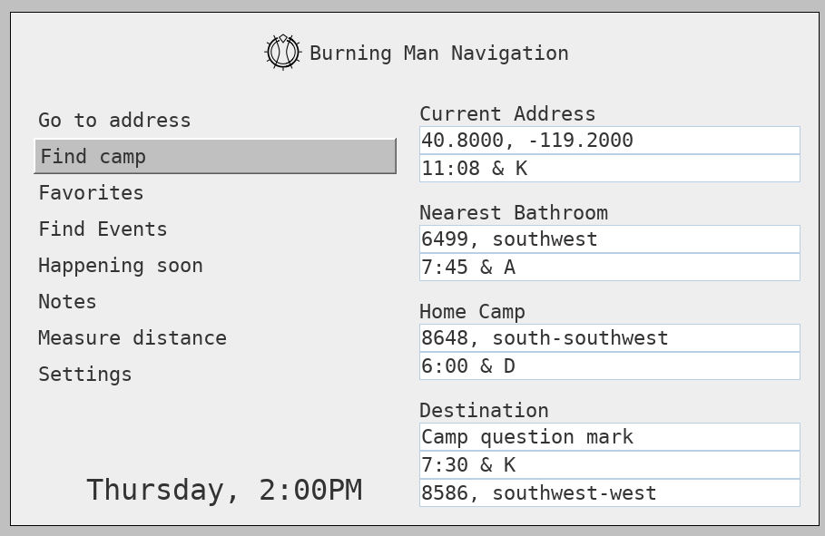

# BurningMan-Navigation



The program BurningMan-Navigation provides directions to various Burning Man landmarks relative to the users current GPS coordinates. The landmarks can be camps, bathroom locations, or art pieces. User interaction is provided using the keyboard or mouse, and most navigation can be completed using a touch-screen. The application also provides functionality for storing favorite locations (based off of either the current location or manually entered addresses), measuring distances, storing notes, and viewing stored events such as music or workshops. 

Directions are provided in the form of distance in feet, a cardinal (east-west) direction, and a bearing (compass direction).

For example, the program can be used to find how to get to the nearest bathroom, or what direction to go to get back to your camp.

# Compiling

If you're recieving the following error:

```
Failed to execute goal on project BurningMan-Navigation: Could not resolve dependencies for project com.BurningManNavigation:BurningMan-Navigation:jar:0.9.8-SNAPSHOT: Failed to collect dependencies at com.intellij:javac2:jar:LATEST: Failed to read artifact descriptor for com.intellij:javac2:jar:LATEST: Failed to resolve version for com.intellij:javac2:jar:LATEST: Could not find metadata com.intellij:javac2/maven-metadata.xml in local (C:\Users\v-brhoop\.m2\repository) -> [Help 1]
```

Per instructions in this stackoverflow post https://stackoverflow.com/questions/32747917/intellij-gui-designer-maven-executable-jar-export, clone the repository at https://github.com/jorichard/ideauidesigner-maven-plugin.

### Windows

first make sure Maven is installed, the PATH variable contains the Maven directory, and the JAVA_HOME environment variable points to main folder of JDK. 

Run the following .bat file:
It may be neccessary to modify the INTELLIJ_HOME variable, as well as the change the names of the .jar files (particularly asm-all) listed here to their actual filenames in the IntelliJ lib folder.

```
SET INTELLIJ_HOME=C:\Program Files\JetBrains\IntelliJ IDEA 2019.1.3
CALL mvn install:install-file -Dfile="%INTELLIJ_HOME%\lib\javac2.jar" -DgroupId=com.intellij -DartifactId=javac2 -Dversion=17.1.5 -Dpackaging=jar
CALL mvn install:install-file -Dfile="%INTELLIJ_HOME%\lib\asm-all-7.0.1.jar" -DgroupId=com.intellij -DartifactId=asm-all -Dversion=17.1.5 -Dpackaging=jar
CALL mvn install:install-file -Dfile="%INTELLIJ_HOME%\lib\forms_rt.jar" -DgroupId=com.intellij -DartifactId=forms_rt -Dversion=17.1.5 -Dpackaging=jar
```

### *nix

Running ```./install-intellij-libs.sh <path to your IntelliJ directory>``` should work out of the box, although as with the Windows batch file it may be necessary to modify the path to the asm-all.jar file. 

### Install plugin

In ideauidesigner-maven-plugin-master directory, add the following lines to the pom.xml file. 

```
  <build>
  	  <plugins>
		  <plugin>
			  <groupId>org.apache.maven.plugins</groupId>
			  <artifactId>maven-compiler-plugin</artifactId>
			  <version>2.3.1</version>
			  <configuration>
				  <source>1.8</source>
				  <target>1.8</target>
			  </configuration>
		  </plugin>
	  </plugins>
  </build>
```

as a child of <project>. This fixes errors like ```error: Source option 6 is no longer supported. Use 7 or later.```
  
Finally, run the command ```mvn install``` in the ideauidesigner-maven-plugin-master. If it completed successfully, the project should now be able to compile.

